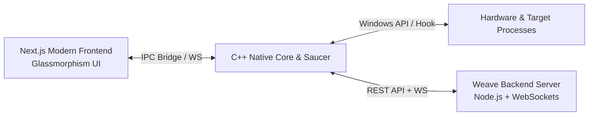

# 🌌 Weave Launcher (C++ / Saucer / Next.js)

A high-performance modern desktop game launcher & injection loader client built with:
- **C++23 Native Core**: Low-latency Windows OS hardware signature extraction (HWID), process watcher, memory mapping injector, and system latency booster.
- **[Saucer](https://github.com/saucer/saucer)**: Lightweight, modern desktop webview engine integrating native C++ with web UI.
- **Next.js & React UI**: Cyberpunk / Dark Glassmorphism gaming dashboard with frameless window controls, live status badges, cloud presets, and performance monitors.
- **Backend Loader Server**: Fast REST API + WebSocket real-time event pipeline for authentication, HWID license binding, encrypted payload delivery, and telemetry.

---

## 🚀 Architecture Overview



### Key Modules:
1. **`frontend/`**:
   - Next.js modern UI with static HTML export (`out/`).
   - Frameless titlebar with custom drag area, minimize/maximize/close actions.
   - Target library (CS2, Rust, Apex Legends, GTA V, Dota 2, Minecraft).
   - Real-time launch pipeline modal with memory mapping animations.
   - System Optimizer: Standby RAM cleaner, 0.5ms Timer Resolution, Anti-Cheat Safe Mode.
   - Cloud Presets hub & Discord Rich Presence toggles.
2. **`src/` & `include/`**:
   - `hwid.cpp`: Real hardware ID generation combining CPU ID, Machine GUID, and Volume Serial Number.
   - `process_manager.cpp`: Process detection (`CreateToolhelp32Snapshot`) and injection coordinator.
   - `system_info.cpp`: Hardware specs extractor formatted as JSON for Saucer IPC bridge.
   - `main.cpp`: Saucer webview runtime with native C++ exposed functions.
3. **`backend_server/`**:
   - Express REST API (`/health`, `/api/v1/auth/login`, `/api/v1/apps`, `/api/v1/loader/payload/:id`, `/api/v1/news`, `/api/v1/stats`).
   - WebSocket `/ws` server streaming live player counts, latency ping, and security broadcast events.

---

## 🛠️ Quick Start

### 1. Start Backend Loader Server
```powershell
cd backend_server
npm install
npm start
```
*Backend runs on `http://localhost:4000` with WebSocket on `ws://localhost:4000/ws`.*

### 2. Start Frontend Dev Server
```powershell
cd frontend
npm install
npm run dev
```
*Frontend runs on `http://localhost:3000`.*

### 3. Build & Run C++ Native Launcher
```powershell
# Configure & Compile with CMake + Ninja / g++
cmake -B build -G "Ninja" -DCMAKE_CXX_COMPILER=g++
cmake --build build

# Run automated native test suite
.\build\weave_launcher.exe --test
```

### 4. Automated Full Build
```powershell
.\scripts\build_all.ps1
```

---

## 🧪 Testing Verification
- **Backend automated test suite**: `node backend_server/test.js`
- **C++ Native engine verification**: `.\build\weave_launcher.exe --test`
- **Frontend static compilation**: `npm run build` in `frontend/` (Verified static export to `out/`)
